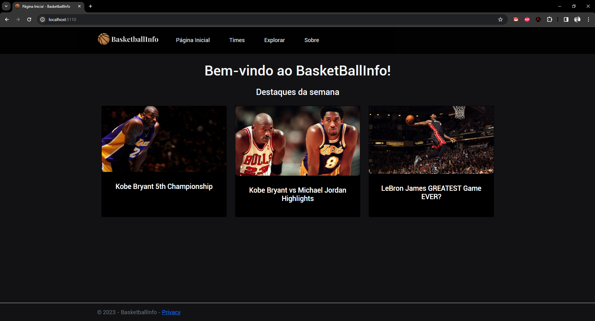
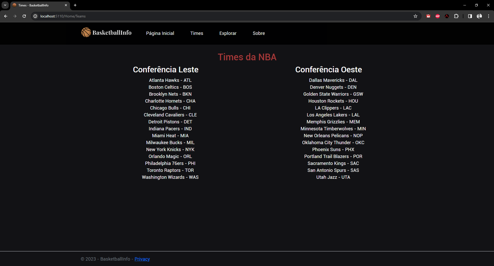
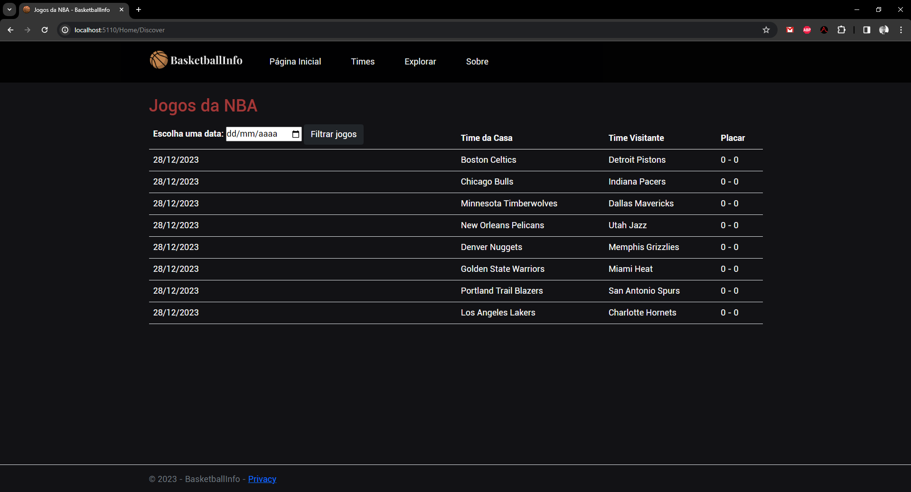

# BasktBallInfo - Um site para visualização de resultados dos jogos da NBA

O BasktBallInfo é uma plataforma desenvolvida em ASP.NET para visualização de resultados dos jogos da NBA através de uma API. Além disso, a plataforma destaca momentos chave e permite o acesso direto aos vídeos no YouTube relacionados aos jogos.

## Capturas de Tela

<!--

 -->

## Tecnologias Utilizadas

O projeto foi desenvolvido utilizando uma variedade de tecnologias e bibliotecas modernas para proporcionar uma experiência robusta e eficiente. Abaixo estão as principais tecnologias utilizadas em cada camada do projeto:

- **Front-end:**

  - HTML5, CSS3, JavaScript para a construção da interface do usuário.
  - Bootstrap 4 para o desenvolvimento de um layout responsivo e estilização consistente.

- **Back-end:**

  - C# como linguagem principal de programação.
  - ASP.NET Core Razor Pages para a criação de páginas web dinâmicas e interativas.
  - Entity Framework Core para interação com o banco de dados.

- **Comunicação com a API:**

  - HttpClient para realizar requisições HTTP à API da NBA.

- **Manipulação de Dados:**
  - System.Text.Json para serialização e desserialização de dados em formato JSON.
  - ASP.NET Core Configuration para gerenciar configurações do aplicativo.

Essas tecnologias foram escolhidas para proporcionar uma base sólida e eficiente, garantindo um desempenho consistente e uma experiência de usuário aprimorada.
